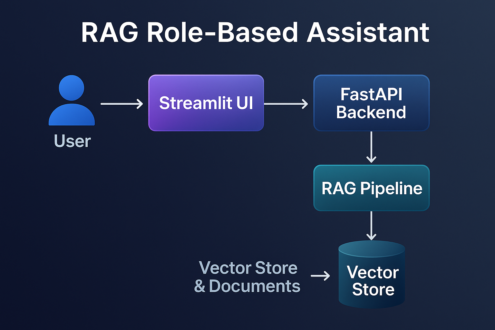

# 📘FinSolve AI: A Role-Based RAG Assistant

An end-to-end **Retrieval-Augmented Generation (RAG)** project with **role-based access control (RBAC)**.
It allows different teams (Finance, HR, Marketing, etc.) to query documents securely and get context-aware responses powered by **Llama (Groq)**.

---

## 🚀 Features

* **Role-Based Access** → Users are authenticated and mapped to roles (Finance, Marketing, HR, etc.) stored in `database.py`.
* **RAG Pipeline** → Document ingestion, embeddings, and vector store retrieval for accurate context-aware responses.
* **FastAPI Backend** → Provides APIs for authentication and querying the RAG system.
* **Streamlit Frontend** → Simple login UI, role display, and real-time Q\&A with spinner-based loading.
* **Production-Ready Structure** → Modular design with separation of backend services and UI.

---

## 🛠️ Tech Stack

* **Streamlit** → Frontend UI
* **FastAPI** → Backend APIs
* **Python** → Core language
* **LLM** → Llama3 from Groq
* **ChromaDB** → Vector search
* **HuggingFace** → Embeddings(Sentence Transformers)


---

## 📂 Project Structure

```
RAG-Role-Based-Assistant/
│── app/
│   ├── auth.py          # Authentication & Role-based access
│   ├── config.py        # Configurations (API keys, paths)
│   ├── database.py      # User database (username, password, roles)
│   ├── rag_chain.py     # RAG chain logic
│   ├── rag_pipeline.py  # Data ingestion, embeddings, vector store
│
│── app.py               # Streamlit frontend (UI)
│── main.py              # FastAPI backend (API server)
│── .env                 # Environment Variables
│── data/                # Sample documents for ingestion
```

---

## ⚡ Getting Started

### 1️⃣ Clone the repository

```bash
git clone https://github.com/your-username/RAG-Role-Based-Assistant.git
cd RAG-Role-Based-Assistant
```

### 2️⃣ Create and activate a virtual environment

```bash
# Create virtual env
python3 -m venv venv  

# Activate (Linux/Mac)
source venv/bin/activate  

# Activate (Windows PowerShell)
venv\Scripts\activate
```

### 3️⃣ Install dependencies

```bash
pip install -r requirements.txt
```

### 4️⃣ Set Environment Variables

Create a `.env` file in the project root and add your **GROQ API key**:

```bash
GROQ_API_KEY=your_groq_api_key_here
```

### 5️⃣ Start the FastAPI backend

```bash
python main.py
```

### 6️⃣ Run the Streamlit frontend

```bash
streamlit run app.py
```
---

## 🔑 Usage

1. Open the Streamlit UI in your browser.
2. Login with a **username and password** (defined in `database.py`).
3. Your **role and username** appear at the top-right corner.
4. Enter a query → The system retrieves context from documents and generates a response.
5. Each role only sees **role-specific data**, ensuring secure and relevant answers.

---

## 📌 Example

* **Login**: `alice / alice123` → Role: Finance
* **Query**: "Show me last quarter’s expenses"
* **Answer**: Retrieved only from **Finance documents**.

---

## 🏗️ Architecture

<p align="center">
  
</p>

---

## 🤝 Contribution

Contributions are welcome! Feel free to fork the repo and submit a pull request.

---

## 📜 License

MIT License. Free to use and modify.